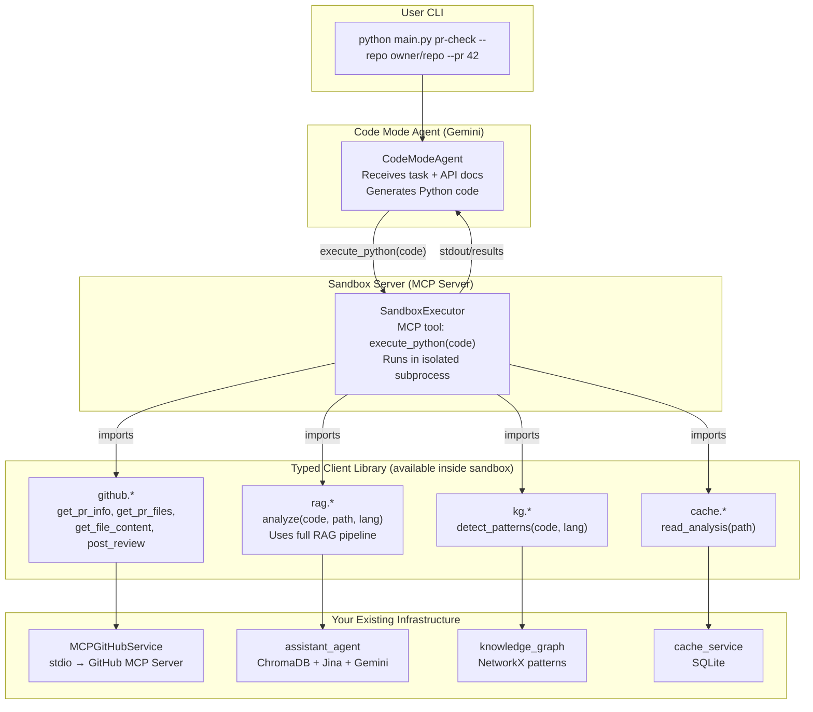

# MCP Code Mode — Corrected Implementation Plan

## What Changed From My Previous Plan

> [!CAUTION]
> My previous plan used **`bind_tools()` with individual tool calls** — that's standard tool calling, NOT MCP Code Mode. Here's the real architecture.

### Previous plan (WRONG — tool calling, not Code Mode)
```
Agent → bind_tools([tool1, tool2, ...]) → individual JSON tool calls
  tool_call: {name: "github_get_pr_files", args: {...}}    ← one call at a time
  tool_call: {name: "analyze_code_with_rag", args: {...}}  ← another call
  tool_call: {name: "github_post_review", args: {...}}     ← another call
```

### Corrected plan (REAL MCP Code Mode)
```
Agent → generates a PYTHON SCRIPT → sandbox executes it → results back

Generated code:
  from code_mode_client import github, rag, kg, cache

  pr = github.get_pr_info("owner", "repo", 42)
  files = github.get_pr_files("owner", "repo", 42)
  for f in files:
      cached = cache.read_analysis(f["filename"])
      if not cached:
          content = github.get_file_content("owner", "repo", f["filename"], pr["head"]["ref"])
          patterns = kg.detect_patterns(content, "java")
          result = rag.analyze(content, f["filename"], "java", patch=f.get("patch",""))
      # ... agent writes the full logic
  github.post_review("owner", "repo", 42, body, "REQUEST_CHANGES", comments)
```

**Key differences:**
| Aspect | Tool Calling (my old plan) | Code Mode (corrected) |
|--------|--------------------------|----------------------|
| What agent produces | JSON tool_calls (one at a time) | **Complete Python script** |
| Where it runs | In the main process | **In a sandbox** |
| Loops & conditions | Agent must reason each step | **Written in code** (for/if/while) |
| Token efficiency | High (schema per tool per turn) | **Low** (typed API doc once) |
| Multi-step operations | N round-trips to LLM | **1 script, 1 execution** |

---

## Architecture Overview



---

## Proposed Changes

### Component 1: Typed Client Library
*The API that the agent's generated code can import inside the sandbox*

---

#### [NEW] [code_mode_client.py](file:///c:/Users/Asus/Desktop/code_auditor/services/code_mode_client.py)

A clean, typed Python API that wraps ALL your existing services. This is what the agent's generated code imports. The agent sees the API documentation and writes code against it.

```python
"""
Code Mode Client — Typed API for agent-generated code.

This module is pre-loaded in the sandbox. Agent-generated scripts
import and use these classes to interact with GitHub (via MCP),
the RAG pipeline, Knowledge Graph, and SQLite cache.
"""

class GitHubClient:
    """Proxy to MCPGitHubService — all GitHub operations go through MCP."""
    
    def get_pr_info(self, owner: str, repo: str, pr_number: int) -> dict:
        """Returns: {title, state, body, mergeable, base: {ref}, head: {ref}}"""
    
    def get_pr_files(self, owner: str, repo: str, pr_number: int) -> list[dict]:
        """Returns: [{filename, status, additions, deletions, patch}]"""
    
    def get_file_content(self, owner: str, repo: str, path: str, ref: str) -> str:
        """Read file content from GitHub at a specific branch/commit"""
    
    def post_review(self, owner: str, repo: str, pr_number: int,
                    body: str, event: str, comments: list[dict] = None) -> dict:
        """Submit PR review. event: APPROVE|REQUEST_CHANGES|COMMENT
        comments: [{path, line, body}] for inline suggestions"""
    
    def post_comment(self, owner: str, repo: str, pr_number: int, body: str) -> dict:
        """Post a general comment on a PR"""
    
    def create_branch(self, owner: str, repo: str, branch: str, from_ref: str) -> dict:
        """Create a new branch"""
    
    def push_file(self, owner: str, repo: str, path: str, content: str,
                  message: str, branch: str) -> dict:
        """Create or update a file on GitHub"""
    
    def get_check_runs(self, owner: str, repo: str, ref: str) -> list[dict]:
        """Get CI check results: [{name, status, conclusion}]"""


class RAGAnalyzer:
    """Proxy to assistant_agent — full RAG pipeline analysis."""
    
    def analyze(self, code: str, file_path: str, language: str,
                patch: str = "") -> dict:
        """Analyze code using ChromaDB + KG + security checklist.
        Returns: {analysis: str, critical: int, high: int, medium: int, score: float}"""
    
    def count_severity(self, analysis_text: str) -> dict:
        """Count severity from FIX blocks.
        Returns: {critical: int, high: int, medium: int, score: float}"""


class KnowledgeGraphClient:
    """Proxy to knowledge_graph — pattern detection."""
    
    def detect_patterns(self, code: str, language: str) -> list[str]:
        """Detect security/architecture patterns (SQL_Injection, Resource_Leak, etc.)"""
    
    def has_pattern(self, code: str, language: str) -> bool:
        """Quick check: does this code contain any known risk patterns?"""


class CacheClient:
    """Proxy to SQLite cache — read previous analyses."""
    
    def read_analysis(self, file_path: str) -> str | None:
        """Read cached analysis if fresh, None if stale/missing"""
    
    def get_recurring_patterns(self, file_path: str) -> list[dict]:
        """Get recurring bug patterns: [{pattern, severity, count}]"""


class ConflictResolver:
    """Proxy to git_conflict_resolver — 3-strategy retry resolution."""
    
    def resolve(self, file_path: str, conflicted_content: str,
                ours_content: str, theirs_content: str,
                project_context: str = "") -> str | None:
        """Resolve a merge conflict with 3 strategies (intelligent → conservative → safe).
        Returns resolved content or None if all strategies fail."""


# Pre-initialized instances (available when the sandbox loads this module)
github = GitHubClient()
rag = RAGAnalyzer()
kg = KnowledgeGraphClient()
cache = CacheClient()
resolver = ConflictResolver()
```

Internally, each class delegates to your existing singletons:
- `GitHubClient` → `MCPGitHubService` (runs async MCP calls via `run_mcp_action()`)
- `RAGAnalyzer` → `assistant_agent.analyze_code_with_rag()` 
- `KnowledgeGraphClient` → `knowledge_graph.detect_patterns()`
- `CacheClient` → `_read_analysis_fresh()` from `git_hook.py`
- `ConflictResolver` → `resolve_single_file()` from `git_conflict_resolver.py`

---

### Component 2: Sandbox Executor (MCP Server)
*Runs agent-generated code in an isolated subprocess*

---

#### [NEW] [sandbox_executor.py](file:///c:/Users/Asus/Desktop/code_auditor/services/sandbox_executor.py)

An MCP server that exposes ONE tool: `execute_python(code)`. The generated code runs in a restricted subprocess with only the `code_mode_client` module available.

```python
"""
Sandbox Executor — MCP Server for Code Mode.

Exposes: execute_python(code: str) → str

Security:
  - Runs in a subprocess (separate PID, can be killed on timeout)
  - Restricted imports (only code_mode_client + stdlib basics)
  - Timeout: 120 seconds max per execution
  - No filesystem access outside the project
  - stdout/stderr captured and returned
"""

from mcp import FastMCP

sandbox = FastMCP("CodeAuditorSandbox")

@sandbox.tool()
async def execute_python(code: str) -> str:
    """Execute Python code in a secure sandbox.
    
    Available imports in the sandbox:
    - code_mode_client (github, rag, kg, cache, resolver)
    - json, re, os.path, pathlib.Path
    
    The code should print() its results — stdout is returned.
    """
    # 1. Write code to a temp file
    # 2. Execute in subprocess with restricted environment
    # 3. Capture stdout/stderr
    # 4. Return results with timeout enforcement
```

**Sandbox restrictions:**
- Subprocess with `subprocess.run(timeout=120)`
- Restricted `__builtins__` (no `open`, `exec`, `eval`, `__import__` for dangerous modules)
- Only `code_mode_client` + safe stdlib available
- No network access (GitHub access goes through MCP, not direct HTTP)
- Working directory: temporary, cleaned after execution

---

### Component 3: Code Mode Agent
*Gemini generates Python code instead of making tool calls*

---

#### [NEW] [code_mode_agent.py](file:///c:/Users/Asus/Desktop/code_auditor/agents/code_mode_agent.py)

The agent that generates Python code to be executed in the sandbox.

```python
"""
Code Mode Agent — Generates Python code for sandbox execution.

Instead of individual tool calls, the agent:
1. Receives a task description + API documentation
2. Generates a complete Python script
3. Sends it to the sandbox for execution
4. Reads the results
5. Optionally generates follow-up code (iterative)
"""

class CodeModeAgent:
    def __init__(self, system_prompt: str):
        self.llm = ChatGoogleGenerativeAI(
            model="gemini-2.5-flash",
            temperature=0.1,
            max_output_tokens=16384,
        )
        self.system_prompt = system_prompt
        self.sandbox = SandboxExecutor()
        self.max_iterations = 3
    
    async def run(self, task: str) -> dict:
        """
        1. Give Gemini the task + API docs
        2. Gemini writes a Python script
        3. Execute in sandbox
        4. Return results (or iterate if error)
        """
        messages = [
            SystemMessage(content=self.system_prompt + API_DOCUMENTATION),
            HumanMessage(content=task),
        ]
        
        for i in range(self.max_iterations):
            # Gemini generates code
            response = self.llm.invoke(messages)
            code = self._extract_code(response.content)
            
            # Execute in sandbox
            result = await self.sandbox.execute(code)
            
            if result.success:
                return self._parse_output(result.stdout)
            
            # Error → let Gemini fix it
            messages.append(AIMessage(content=response.content))
            messages.append(HumanMessage(
                content=f"Execution error:\n{result.stderr}\nFix the code."
            ))
        
        return {"error": "Max iterations reached"}
```

The `API_DOCUMENTATION` constant contains the typed API docs from `code_mode_client.py` — this is what Gemini reads to know what it can call. **Much more token-efficient** than loading 10+ tool schemas per turn.

---

### Component 4: Three Specialized Agents
*Same pattern, different system prompts*

---

#### [NEW] [pr_review_agent.py](file:///c:/Users/Asus/Desktop/code_auditor/smart_git/pr_review_agent.py)

**PR Review Agent** — System prompt tells Gemini to write code that:
```python
# Agent generates something like this:
from code_mode_client import github, rag, kg, cache
import json

pr = github.get_pr_info("owner", "repo", 42)
files = github.get_pr_files("owner", "repo", 42)
head_ref = pr["head"]["ref"]

reviews = []
total_score = 0
total_critical = 0

for f in files:
    if f["status"] == "removed":
        continue
    ext = f["filename"].rsplit(".", 1)[-1] if "." in f["filename"] else ""
    if ext not in ("py", "java", "js", "ts", "jsx", "tsx"):
        continue

    # Check cache first
    cached = cache.read_analysis(f["filename"])
    if cached:
        severity = rag.count_severity(cached)
    else:
        content = github.get_file_content("owner", "repo", f["filename"], head_ref)
        patterns = kg.detect_patterns(content, ext)
        result = rag.analyze(content, f["filename"], ext, patch=f.get("patch", ""))
        severity = result

    total_score += severity["score"]
    total_critical += severity["critical"]

    if severity["critical"] > 0 or severity["high"] > 0:
        reviews.append({
            "path": f["filename"],
            "line": 1,
            "body": f"⚠️ {severity['critical']}C {severity['high']}H — {result.get('analysis', cached)[:500]}"
        })

# Decide verdict
if total_critical > 0 or total_score >= 35:
    event = "REQUEST_CHANGES"
    body = f"🔴 **MERGE BLOQUÉ** — {total_critical} CRITICAL, score {total_score}"
elif total_score >= 15:
    event = "COMMENT"  
    body = f"🟡 **MERGE AVEC PRÉCAUTION** — score {total_score}"
else:
    event = "APPROVE"
    body = f"🟢 **MERGE AUTORISÉ** — score {total_score}"

github.post_review("owner", "repo", 42, body, event, reviews)
print(json.dumps({"verdict": event, "score": total_score, "critical": total_critical}))
```

The agent writes this kind of code **autonomously**. It can add more logic, handle edge cases, check more things — because it's writing real code, not making individual tool calls.

---

#### [NEW] [conflict_resolution_agent.py](file:///c:/Users/Asus/Desktop/code_auditor/smart_git/conflict_resolution_agent.py)

**Conflict Resolution Agent** — System prompt tells Gemini to write code that resolves PR conflicts using `resolver.resolve()`.

---

#### [NEW] [merge_automation_agent.py](file:///c:/Users/Asus/Desktop/code_auditor/smart_git/merge_automation_agent.py)

**Merge Automation Agent** — System prompt tells Gemini to write code that checks merge readiness (CI + reviews + analysis).

---

### Component 5: Extended MCP Service

#### [MODIFY] [mcp_github_service.py](file:///c:/Users/Asus/Desktop/code_auditor/services/mcp_github_service.py)

Same as before — add `create_pr_review()`, `get_check_runs()`, `get_pr_reviews()` to the existing MCP client.

---

### Component 6: Rewired Entry Points

#### [MODIFY] [pr_analyzer.py](file:///c:/Users/Asus/Desktop/code_auditor/smart_git/pr_analyzer.py)

Delegates to Code Mode agents instead of running a fixed pipeline.

#### [MODIFY] [main.py](file:///c:/Users/Asus/Desktop/code_auditor/main.py)

Add `pr-merge-check` command.

---

## File Summary

| File | Action | Purpose |
|------|--------|---------|
| `services/code_mode_client.py` | **NEW** | Typed client library (API for agent code) |
| `services/sandbox_executor.py` | **NEW** | MCP server — `execute_python(code)` in sandbox |
| `agents/code_mode_agent.py` | **NEW** | Code Mode agent — generates & executes Python |
| `smart_git/pr_review_agent.py` | **NEW** | PR review via Code Mode |
| `smart_git/conflict_resolution_agent.py` | **NEW** | Conflict resolution via Code Mode |
| `smart_git/merge_automation_agent.py` | **NEW** | Merge readiness check via Code Mode |
| `services/mcp_github_service.py` | MODIFY | Add review/CI capabilities |
| `smart_git/pr_analyzer.py` | MODIFY | Delegate to Code Mode agents |
| `main.py` | MODIFY | Add `pr-merge-check` command |
| `requirements.txt` | MODIFY | Add `fastmcp>=1.0.0` |

---

## How Code Mode Uses Your Context

```
Agent generates code that calls:
  rag.analyze(code, path, lang)
       ↓
  assistant_agent.analyze_code_with_rag()
       ↓
  ChromaDB retrieval + KG patterns + security checklist + Gemini analysis
       ↓
  Full RAG pipeline with cross-encoder reranking
```

Every analysis goes through your **complete pipeline**: ChromaDB → Jina embeddings → cross-encoder reranking → Knowledge Graph → security checklist → Gemini. Zero duplication.

---

## Open Questions

> [!IMPORTANT]
> ### 1. Sandbox strictness level
> Since this is a local developer tool (not a public service), how strict should the sandbox be?
> - **Option A (lightweight):** `subprocess.run()` with restricted `sys.path` and timeout — sufficient for a dev tool
> - **Option B (Docker):** Full Docker container isolation — overkill for this use case but more secure
> 
> I recommend **Option A** for now — you can upgrade to Docker later.

> [!IMPORTANT]
> ### 2. FastMCP vs raw MCP SDK
> The sandbox server can use either:
> - `FastMCP` (higher-level, simpler) — `pip install fastmcp`
> - Raw `mcp` SDK (what you already use) — already in requirements
> 
> I recommend **raw `mcp` SDK** since you already depend on it.

> [!IMPORTANT]
> ### 3. Do you want the agent to be iterative?
> If the sandbox execution fails (e.g., wrong API call), should the agent:
> - **Option A:** Get the error back and generate fixed code (up to 3 attempts)
> - **Option B:** Fail immediately and report the error
> 
> I recommend **Option A** — self-correcting agents are more robust.

---

## Verification Plan

### Automated Tests
1. Test `code_mode_client.py` — verify each method delegates to the right service
2. Test `sandbox_executor.py` — verify code runs in subprocess, timeout works, restricted imports
3. Test `code_mode_agent.py` — verify code extraction from Gemini's response
4. End-to-end: agent generates code → sandbox executes → results returned

### Manual Verification
1. `python main.py pr-check --repo your/repo --pr N`
   - Check console: "Agent generating code..." → "Executing in sandbox..." → results
   - Check GitHub: proper review posted (not just a comment)
2. `python main.py pr-resolve --repo your/repo --pr N`
   - Verify conflict resolution uses `resolve_single_file()` with 3-strategy retry
3. Token usage: verify the agent generates 1 complete script instead of N tool calls
